<!-- ===================== HERO ===================== -->

  

  

  <a href="mailto:yeharadananjaya@gmail.com"><b>Email</b></a> •
  <a href="https://linkedin.com/in/yehara-dananjaya"><b>LinkedIn</b></a> •
  <a href="https://instagram.com/yehara_dananjaya"><b>Instagram</b></a> •
  <a href="https://fb.com/yehara.dananjaya"><b>Facebook</b></a>

  
  

<h2>Snapshot</h2>

<ul>
  <li><b>Focus:</b> building modern web apps with clean UI, reusable components, and performance-first thinking.</li>
  <li><b>Now learning:</b> Angular • React Native • AWS</li>
  <li><b>Open to:</b> internships • freelance • collaborations</li>
  <li><b>Contact:</b> yeharadananjaya@gmail.com</li>
</ul>

<h2>Tech Stack</h2>

  

  
<b>More tools</b>

   
  

    
  

<h2>Featured Projects</h2>

  <a href="https://github.com/LSYDananjaya?tab=repositories"><b>View my repositories</b></a> •
  <a href="https://github.com/LSYDananjaya?tab=stars"><b>Starred projects</b></a>

<h2>GitHub Stats</h2>

  
  

  

<h2>Activity</h2>

  

<h2>Contribution Snake</h2>

  <picture>
    <source media="(prefers-color-scheme: dark)" srcset="https://raw.githubusercontent.com/LSYDananjaya/LSYDananjaya/output/github-snake-dark.svg" />
    <source media="(prefers-color-scheme: light)" srcset="https://raw.githubusercontent.com/LSYDananjaya/LSYDananjaya/output/github-snake.svg" />
    
  </picture>

  <i>"Code is like humor. When you have to explain it, it’s bad."</i> — Cory House

  

